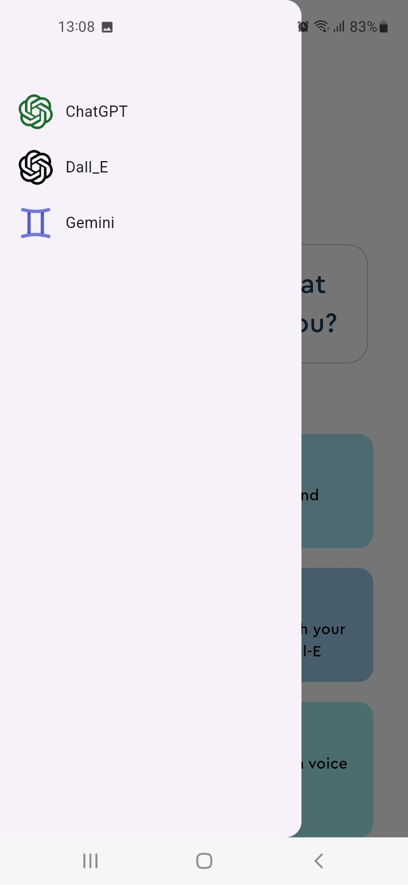

# lab33_qnais

C'est une application mobile Flutter qui permet d'enregistrer et d'envoyer des messages audio, tout en offrant la possibilité de les interrompre. De plus, l'utilisateur peut générer des images en saisissant simplement le nom de l'image souhaitée.

## App

 
 
 
